 

## [ PROFILE ]

17-year-old backend engineer focused on low-level systems and computer architecture. Transitioning to Go while maintaining a deep interest in bare-metal simulation.

Currently an applicant for the **ITMO STARS 2026** program.

---

## [ CORE STACK ]

---

## [ PROJECT: SIMCOM v2.0 ]

SimCom represents a high-fidelity 16-bit CPU emulator built as a complete software-defined machine. The goal: reproduce classical Von Neumann architecture at the instruction level with full observability.

**Architecture:**
- **Segmented Memory Model:** CS, DS, and SS registers provide explicit isolation of code, data, and stack segments across a 64K address space (0x0000 to 0xFFFF).
- **Hardware Fidelity:** Two's Complement arithmetic throughout the ALU. Signed overflow, zero, and negative flags are tracked per instruction via a dedicated FLAGS register. Custom ISA covers 24 operations including data transfer, arithmetic, bitwise logic, branching, subroutine calls, stack operations, and I/O.
- **Integrated Environment:** Flask REST API exposes per-step execution endpoints. Each session runs an isolated emulator instance. React frontend provides a live register file viewer, memory inspector, and inline assembler input.
- **Deployment:** Fully containerized via Docker Compose. Single command boot, no host dependencies required.

[View Repository](https://github.com/irumka/simcom)

---

## [ METRICS ]

---

## [ CONTACT ]

[Telegram](https://t.me/irumik) &nbsp;·&nbsp; [Email](mailto:kirill_vasyutchenkov@mail.ru)
